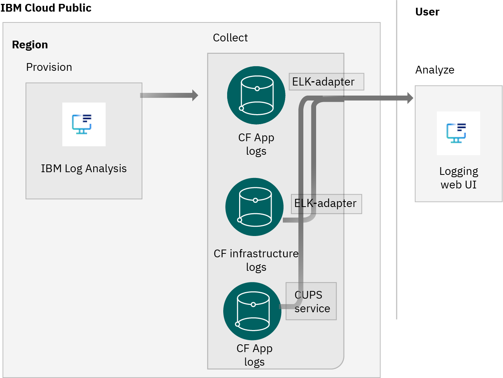
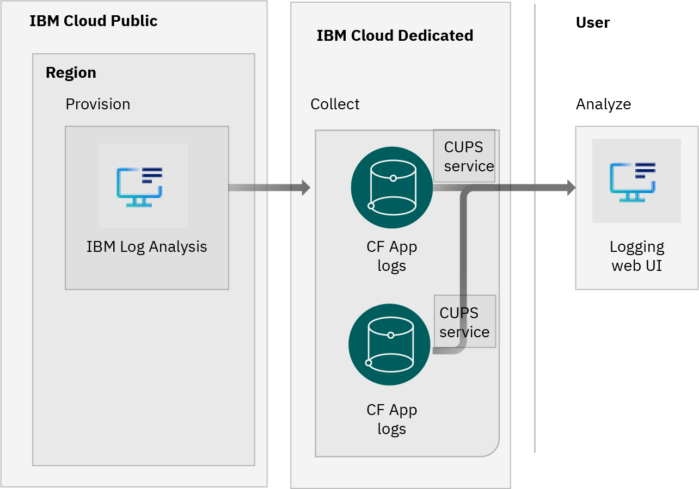

---

copyright:
  years:  2018, 2021
lastupdated: "2021-04-12"

keywords: IBM, Log Analysis, logging, infrastructure

subcollection: log-analysis

---

{{site.data.keyword.attribute-definition-list}}

# Logging with infrastructure overview
{: #infra_logging}

In {{site.data.keyword.la_short}}, you can send infrastructure logs to an {{site.data.keyword.la_full_notm}} instance from a broad range of sources:
{: shortdesc}

## Logging with Cloud Foundry
{: #infra_logging_cf}

In {{site.data.keyword.cloud}} public, you can monitor logs from Cloud Foundry (CF) resources that run in the {{site.data.keyword.cloud_notm}} or outside the {{site.data.keyword.cloud_notm}} by using the {{site.data.keyword.la_full_notm}} service.

If your CF resources run on {{site.data.keyword.cloud_notm}} public, you can choose to automatically collect these logs and monitor them through the {{site.data.keyword.la_full_notm}} instance that is provisioned in the same region, and that is enabled to host service platform logs. Alternatively, you can choose to configure a custom user provided (CUPS) service for your app, so system and application logs are collected and streamed to a custom logging instance.

If your CF resources run on {{site.data.keyword.cloud_notm}} dedicated or outside the {{site.data.keyword.cloud_notm}}, you can configure a custom user provided (CUPS) service for your app, so system and application logs are collected and streamed to a custom logging instance.

|                          |
|--------------------------|
|  |
{: caption="Methods that can be adopted to monitor CF resource logs in {{site.data.keyword.cloud_notm}} public" caption-side="top"}
{: #end-api-img-2}
{: tab-title="Monitor CF resources in IBM Cloud Public"}
{: tab-group="cf-img"}
{: class="simple-tab-table"}

|                          |
|--------------------------|
|  |
{: caption="Methods that can be adopted to monitor CF resource logs in {{site.data.keyword.cloud_notm}} dedicated" caption-side="top"}
{: #end-api-img-1}
{: tab-title="Monitor CF resources in IBM Cloud Dedicated"}
{: tab-group="cf-img"}
{: class="simple-tab-table"}

|                          |
|--------------------------|
|  |
{: caption="Methods that can be adopted to monitor CF resource logs outside the {{site.data.keyword.cloud_notm}}" caption-side="top"}
{: #end-api-img-3}
{: tab-title="Monitor CF resources outside the IBM Cloud Public"}
{: tab-group="cf-img"}
{: class="simple-tab-table"}

For more information, see [Logging with Cloud Foundry](/docs/log-analysis?topic=log-analysis-monitor_cfapp_logs).

## Logging with Kubernetes clusters
{: #infra_logging_cluster}

You can configure a logging agent to collect logs from a Kubernetes cluster and forward them to an instance of the {{site.data.keyword.la_full_notm}} service. 

You can collect and monitor logs from a Kubernetes cluster that is located in the same {{site.data.keyword.cloud_notm}} region as your {{site.data.keyword.la_full_notm}} instance or in a different one. You can also collect and monitor logs from clusters that are located outside the {{site.data.keyword.cloud_notm}}.

To configure cluster-level logging for a Kubernetes cluster, you must complete the following steps:

1. Provision an instance of the {{site.data.keyword.la_full_notm}} service. With this step, you configure a centralized log management system where log data is hosted on {{site.data.keyword.cloud_notm}}.
2. Provision a cluster, for example, a standard cluster on the {{site.data.keyword.containerlong_notm}}.
3. Deploy and configure the logging agent in the cluster.

For more information, see [Logging with Kubernetes clusters](/docs/log-analysis?topic=log-analysis-kube).

## Logging with Bare metals
{: #infra_logging_bm}

You can use the {{site.data.keyword.la_full}} service to monitor and manage logs from a bare metal in a centralized logging system on the {{site.data.keyword.cloud_notm}}. You can collect and monitor system and application logs. 

By default, the logging agent on Linux servers monitors log files in the `/var/log` directory. For example, the Ubuntu system log (`/var/log/syslog`) is monitored by default.

On the {{site.data.keyword.cloud_notm}}, you can configure an bare metal to forward logs to an {{site.data.keyword.la_full_notm}} instance by completing the following steps:

1. Provision a bare metal running Ubuntu Linux.
2. Provision an instance of the {{site.data.keyword.la_full_notm}} service. 
2. Configure the logging agent in the bare metal.
3. Optionally, add additional directories to be monitored by the agent.

For more information, see [Logging with Bare metals](/docs/log-analysis?topic=log-analysis-ubuntu_baremetal).

## Logging with VPC instances 
{: #infra_logging_vpc}

You can use the {{site.data.keyword.la_full}} service to monitor and manage logs from a Linux VPC server instance in a centralized logging system on the {{site.data.keyword.cloud_notm}}. You can collect and monitor system and application logs. 

By default, the logging agent for Linux VPC instances monitors log files in the `/var/log` directory. For example, the Ubuntu system log (`/var/log/syslog`) is monitored by default.

On the {{site.data.keyword.cloud_notm}}, you can configure a Linux VPC server to forward logs to an {{site.data.keyword.la_full_notm}} instance by completing the following steps:

1. Provision a VPC running Ubuntu Linux for example.
2. Provision an instance of the {{site.data.keyword.la_full_notm}} service. 
2. Configure the logging agent in the Ubuntu server.
3. Optionally, add additional directories to be monitored by the agent.

For more information, see [Logging with Linux VPC server instances](/docs/log-analysis?topic=log-analysis-ubuntu).

## Logging with Syslog
{: #infra_logging_syslog}

You can send logs to an {{site.data.keyword.la_full_notm}} instance via Syslog. TCP and TCP+TLS are both supported.

To use a custom port to send logs via UDP, you can open an IBM support ticket. For information about opening an IBM support ticket, or about support levels and ticket severities, see [Getting support](/docs/get-support).

